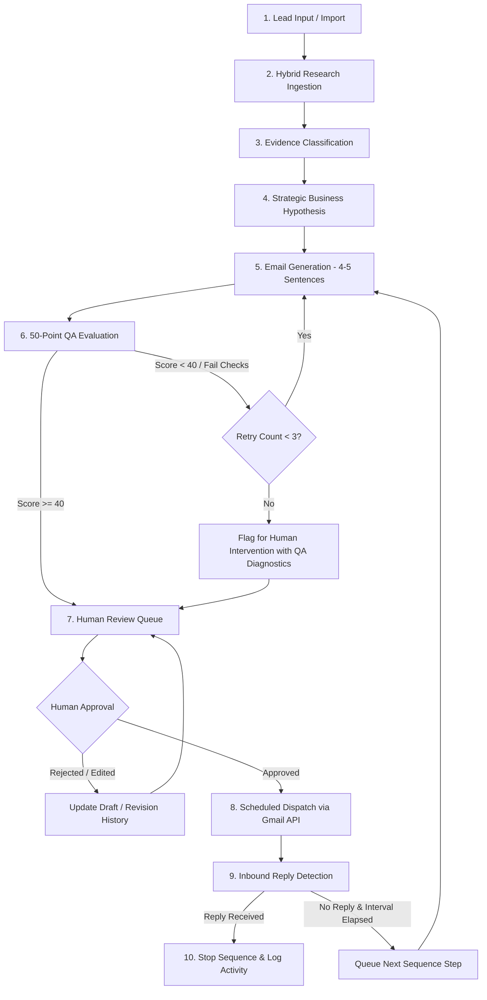
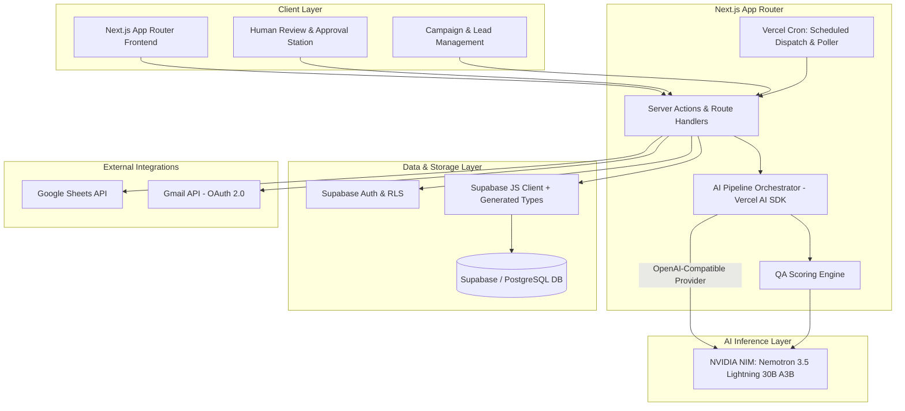
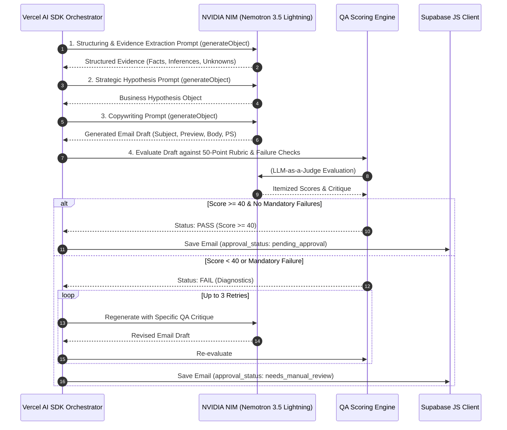
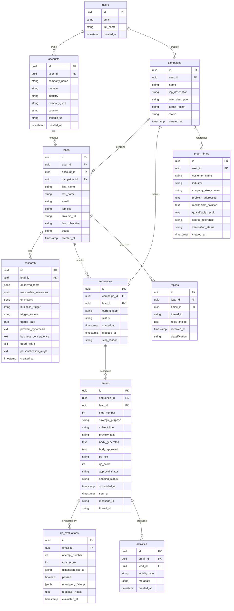
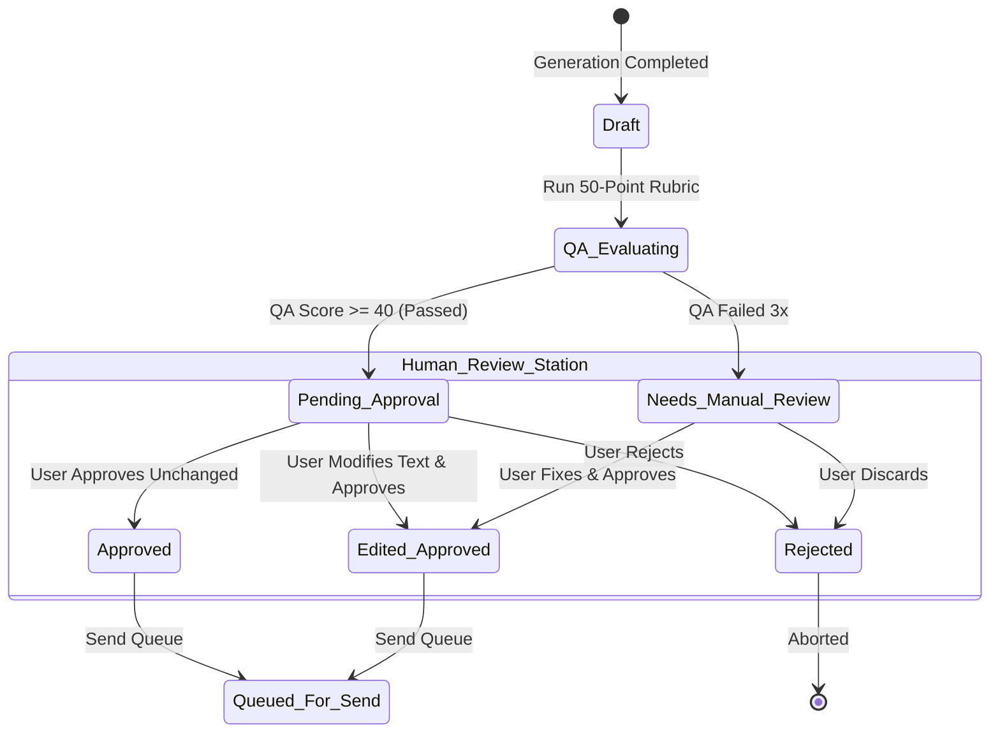
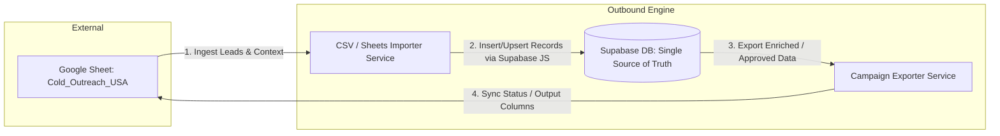
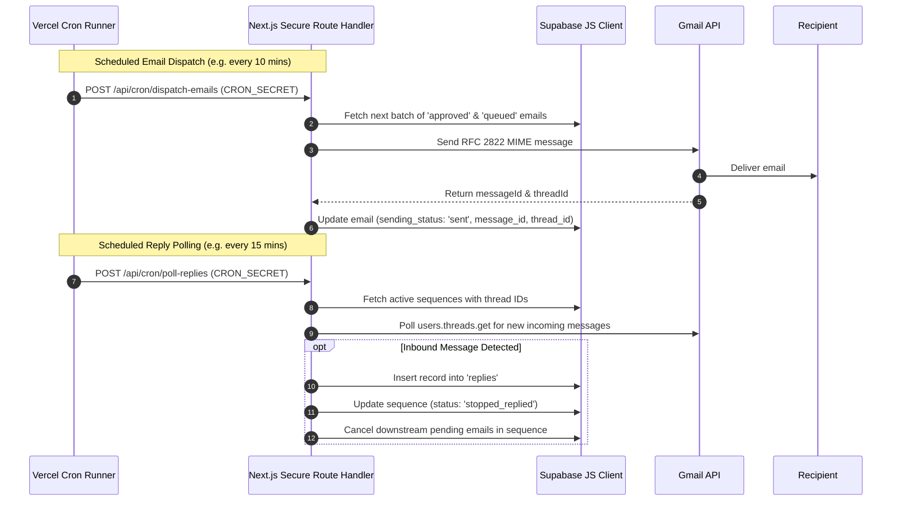

# Outbound Engine V1 — Technical Architecture Document

> **Document Status:** Approved Technical Specification  
> **Version:** 1.0.0  
> **Scope:** Outbound Engine V1 Application Architecture  
> **Authoritative Sources of Truth:** [`context/cold-email-context.md`](file:///c:/Users/Syed/Outbound-Engine/Outbound-Engine/context/cold-email-context.md) (Strategic) & [`skills/cold-email-copywriter.md`](file:///c:/Users/Syed/Outbound-Engine/Outbound-Engine/skills/cold-email-copywriter.md) (Copywriting & QA)

---

## 1. Purpose

The purpose of this document is to define the technical architecture, data structures, AI pipeline, security boundaries, and operational workflows for **Outbound Engine V1** prior to writing application code.

Outbound Engine is an open-source framework and human-in-the-loop (HITL) application for building research-driven, buyer-centric B2B outbound email campaigns. Rather than generating generic sales copy at scale, Outbound Engine operates backwards from the prospect's business context:

$$\text{Research} \longrightarrow \text{Evidence} \longrightarrow \text{Hypothesis} \longrightarrow \text{Message} \longrightarrow \text{QA} \longrightarrow \text{Human Approval} \longrightarrow \text{Dispatch}$$

---

## 2. Product Scope

### V1 Scope Focus
- **Channel Focus:** **Email only**. Cold calling scripts and LinkedIn touches are architecturally recognized as future extensions but are **strictly out of scope for V1 implementation**.
- **Execution Model:** **Human-in-the-Loop (HITL)**. No email is sent autonomously without explicit human review and approval.
- **Workflow Modality:** Staged, modular AI pipeline with quantitative quality assurance (50-point QA gating) and audit trails.
- **Data Boundary:** Supabase/PostgreSQL is the single source of truth. Google Sheets is an external import/export integration only.

---

## 3. V1 Workflow

The end-to-end lifecycle of a lead through Outbound Engine V1 proceeds through the following sequential stages:



### Workflow Steps Detail:
1. **Lead Input / Import:** Lead data is imported via CSV or Google Sheets integration into Supabase.
2. **Hybrid Research Ingestion:** System takes baseline user-supplied attributes and enriches company and trigger context.
3. **Evidence Classification:** Findings are classified strictly into *Observed Facts*, *Reasonable Inferences*, and *Unknowns*.
4. **Business Hypothesis Formulation:** Synthesizes `Trigger → Current State → Friction → Consequence → Future State → Proof → CTA`.
5. **Email Generation:** Generates subject line, preview text, and a tight 4–5 sentence body adhering to the copywriter skill.
6. **50-Point QA Evaluation:** Evaluated across 10 scoring dimensions (target $\ge 40/50$) plus mandatory failure checks.
7. **Human Review & Approval:** User inspects research notes, QA scores, reasoning metadata, and email copy; edits or approves.
8. **Email Dispatch:** Sends approved emails via authenticated Gmail API.
9. **Reply Detection & Sequence Control:** Inbound webhook / poller detects prospect replies, logs activity, and halts downstream sequence steps.

---

## 4. System Architecture

Outbound Engine V1 is architected as a cohesive full-stack web application designed for minimal operational overhead:



### Architectural Principles
1. **Simplicity & Small Operational Footprint:** V1 prioritizes simplicity, maintainability, and a small operational footprint over architectural completeness. Avoid adding infrastructure, services, or abstractions unless they solve a demonstrated V1 requirement.
2. **Prospect-First:** Structure messaging around the buyer’s operational reality, not the sender’s product features.
3. **Evidence Before Inference:** Separate what is verified from what is deduced; zero tolerance for hallucinated facts.
4. **Human Approval Mandatory:** No email leaves the system without explicit human sign-off.
5. **Modular AI Pipeline:** Distinct, observable stages rather than opaque autonomous black boxes.
6. **Database as Single Source of Truth:** Supabase/PostgreSQL owns all application state, relations, and audit trails via the Supabase JS client.
7. **Google Sheets as Integration:** Sheets is an external import/export transit format, never the primary database.
8. **No Fabricated Proof:** Social proof must be verified against an authentic proof library.
9. **Full Auditability:** Every stage (research, generation, QA score breakdown, human edits) is logged with timestamps and diffs.
10. **Security by Default:** User data isolation via Row Level Security (RLS), encrypted OAuth tokens, and strict secret hygiene.
11. **Email-First with Future Extensibility:** Build clean abstractions that allow LinkedIn and Voice to plug in post-V1.
12. **Open Source Core Separated from Hosted Apps:** Keep framework logic clean and unentangled with proprietary hosting logic.
13. **Independent Deployability:** Antigravity and OpenCode are local development and testing environments; neither is a production dependency. The production application must be completely self-contained and independently deployable from the repository to standard cloud environments (e.g., Vercel + Supabase).

---

## 5. AI Pipeline & Model Configuration

### Model Abstraction & Inference Target
- **Model Abstraction Layer:** **Vercel AI SDK** (`ai` with `@ai-sdk/openai`). The Vercel AI SDK provides standardized streaming, structured outputs (via Zod schemas), and typed error handling.
- **Inference Provider:** **NVIDIA NIM** running **Nemotron 3.5 Lightning 30B A3B**. The Vercel AI SDK is configured to target NVIDIA NIM's OpenAI-compatible API endpoint (`https://integrate.api.nvidia.com/v1`).
- **Development Tooling Boundary:** OpenCode and Antigravity may be used as development and testing environments, but neither is a production runtime dependency.



### Stage Specifications

| Stage | Input Schema | Primary Task | Output Schema |
|---|---|---|---|
| **1. Research Ingestion** | Raw Lead Data, Company URL | Ingest user-provided attributes and public domain data | `LeadResearchInput` |
| **2. Evidence Structuring** | `LeadResearchInput` | Classify observed facts vs. reasonable inferences vs. unknowns | `EvidenceStructure` (Facts[], Inferences[], Unknowns[]) |
| **3. Strategic Hypothesis** | `EvidenceStructure`, Campaign Context | Synthesize `Trigger → Current State → Friction → Consequence → Future State → Proof → CTA` | `BusinessHypothesis` |
| **4. Copywriter** | `BusinessHypothesis`, `VerifiedProof`, Touch # | Write 4–5 sentence draft, 3–5 subject lines, paired preview text | `EmailDraft` (Subject, Preview, Body, PS) |
| **5. QA Evaluator** | `EmailDraft`, `EvidenceStructure`, `BusinessHypothesis` | Score across 10 dimensions (1–5), check mandatory failure rules | `QAEvaluationResult` (TotalScore, ItemizedScores, FailureReasons) |
| **6. Human Review** | `EmailDraft`, `QAEvaluationResult`, `BusinessHypothesis` | Human inspects, edits, approves, or rejects | `ApprovedEmail` (FinalSubject, FinalBody, ApprovedBy, Timestamp) |

---

## 6. Data Model

The persistence layer is built on **Supabase (PostgreSQL)** with Row Level Security (RLS) enabled across all tables.

### Data Access Architecture
- **Data Access Client:** **Supabase JS client (`@supabase/supabase-js`)**.
- **Type Safety:** **Supabase-generated TypeScript definitions** (`supabase gen types typescript`) provide full compile-time safety without the overhead of an external ORM (such as Drizzle or Prisma) in V1.



### Table Definitions

#### 1. `users`
- **Purpose:** Identifies platform users and campaign owners.
- **Important Fields:** `id` (UUID), `email`, `full_name`, `created_at`.
- **Relationships:** One-to-many with `campaigns`, `accounts`, `proof_library`.
- **Status Fields:** None.

#### 2. `accounts`
- **Purpose:** Stores company/organization entity data.
- **Important Fields:** `id`, `user_id`, `company_name`, `domain`, `industry`, `company_size`, `country`, `linkedin_url`.
- **Relationships:** Belongs to `users`; has many `leads`.
- **Status Fields:** None.

#### 3. `leads`
- **Purpose:** Stores individual prospect contact records.
- **Important Fields:** `id`, `user_id`, `account_id`, `campaign_id`, `first_name`, `last_name`, `email`, `job_title`, `linkedin_url`, `lead_objective`.
- **Relationships:** Belongs to `accounts`, `campaigns`; has one `research`, has many `sequences`, `emails`, `replies`.
- **Status Fields:** `status` (`imported`, `researched`, `in_sequence`, `replied`, `unresponsive`, `unsubscribed`, `bounced`).

#### 4. `campaigns`
- **Purpose:** Groups outbound efforts under specific ICP, offer, and regional targets.
- **Important Fields:** `id`, `user_id`, `name`, `icp_description`, `offer_description`, `target_region`.
- **Relationships:** Belongs to `users`; has many `leads`, `sequences`.
- **Status Fields:** `status` (`draft`, `active`, `paused`, `completed`, `archived`).

#### 5. `research`
- **Purpose:** Stores structured evidence, hypotheses, and triggers extracted for a lead.
- **Important Fields:** `id`, `lead_id`, `observed_facts` (JSONB), `reasonable_inferences` (JSONB), `unknowns` (JSONB), `business_trigger`, `trigger_source`, `trigger_date`, `problem_hypothesis`, `business_consequence`, `future_state`, `personalization_angle`.
- **Relationships:** Belongs to `leads`.
- **Status Fields:** None.

#### 6. `sequences`
- **Purpose:** Tracks sequence progression and state for a specific lead within a campaign.
- **Important Fields:** `id`, `campaign_id`, `lead_id`, `current_step` (1–6), `started_at`, `stopped_at`, `stop_reason`.
- **Relationships:** Belongs to `campaigns` and `leads`; has many `emails`.
- **Status Fields:** `status` (`pending`, `active`, `paused`, `completed`, `stopped_replied`, `stopped_manual`).

#### 7. `emails`
- **Purpose:** Stores individual generated and approved email drafts per sequence touch.
- **Revision Tracking:** Directly stores `body_generated` (original model output) and `body_approved` (final reviewed text).
- **Important Fields:** `id`, `sequence_id`, `lead_id`, `step_number` (1–6), `strategic_purpose`, `subject_line`, `preview_text`, `body_generated`, `body_approved`, `ps_text`, `qa_score`, `scheduled_at`, `sent_at`, `message_id`, `thread_id`.
- **Relationships:** Belongs to `sequences` and `leads`; has many `qa_evaluations`, `activities`.
- **Status Fields:**
  - `approval_status` (`draft`, `qa_passed`, `qa_failed`, `pending_approval`, `approved`, `rejected`, `edited`, `needs_manual_review`).
  - `sending_status` (`unapproved`, `queued`, `sending`, `sent`, `failed`, `cancelled`).

#### 8. `qa_evaluations`
- **Purpose:** Stores audit logs of 50-point QA runs, rubric breakdowns, and failure reasons.
- **Important Fields:** `id`, `email_id`, `attempt_number`, `total_score`, `dimension_scores` (JSONB: 10 dimensions $\times$ 1–5), `passed` (BOOLEAN), `mandatory_failures` (JSONB), `feedback_notes`, `evaluated_at`.
- **Relationships:** Belongs to `emails`.
- **Status Fields:** `passed` (`true`, `false`).

#### 9. `activities`
- **Purpose:** Immutable event log of all outbound actions, lifecycle triggers, and human edit audits.
- **Important Fields:** `id`, `email_id`, `lead_id`, `activity_type` (`generated`, `qa_evaluated`, `human_edited`, `approved`, `sent`, `opened`, `bounced`, `failed`), `metadata` (JSONB storing edit diffs and timestamps), `created_at`.
- **Relationships:** Belongs to `emails` and `leads`.
- **Status Fields:** None.

#### 10. `replies`
- **Purpose:** Stores detected incoming replies to campaign threads.
- **Important Fields:** `id`, `lead_id`, `email_id`, `thread_id`, `reply_snippet`, `received_at`, `classification` (`interested`, `not_interested`, `wrong_person`, `ooo`, `unclassified`).
- **Relationships:** Belongs to `leads` and `emails`.
- **Status Fields:** `classification`.

#### 11. `proof_library`
- **Purpose:** Houses verified customer stories, case studies, metrics, and reference mechanisms to prevent AI hallucination.
- **Important Fields:** `id`, `user_id`, `customer_name`, `industry`, `company_size_context`, `problem_addressed`, `mechanism_solution`, `quantifiable_result`, `source_reference`.
- **Relationships:** Belongs to `users`.
- **Status Fields:** `verification_status` (`verified`, `provisional`, `deprecated`).

---

## 7. Email Sequence Model

Outbound Engine implements a **6-touch progressive sequence**. Each touch serves a dedicated strategic objective and must introduce new value rather than asking if the prospect read previous emails:

| Touch # | Strategic Purpose | Narrative Architecture | Core Copy Rule |
|---|---|---|---|
| **Touch 1** | **Relevance** | Trigger $\rightarrow$ Problem $\rightarrow$ Future State + Proof $\rightarrow$ Low-friction CTA | 4–5 sentences max. Establish immediate context. |
| **Touch 2** | **Reframe** | Alternative Problem Perspective $\rightarrow$ Consequence $\rightarrow$ Open question | Shift viewpoint; do not repeat Touch 1 verbatim. |
| **Touch 3** | **Proof** | Specific verified customer outcome $\rightarrow$ Mechanism $\rightarrow$ Validation CTA | Anchor credibility with industry-matched evidence. |
| **Touch 4** | **Insight** | Value-add observation or industry trend $\rightarrow$ Non-demanding takeaway | High standalone value even if they never buy. |
| **Touch 5** | **Objection Removal** | Address primary reason for inaction (timing, bandwidth, risk) $\rightarrow$ Reassurance | Lower perceived barrier to initial dialogue. |
| **Touch 6** | **Decision Point** | Low-friction fork (Yes / No / Later / Wrong person) $\rightarrow$ Clean closure | Give graceful, easy exit or referral path. |

### Technical Sequence Governance
- **Sequence Generation:** Step 1 is generated during initial intake. Subsequent touches are generated with full awareness of previous drafts.
- **Cadence Rules:** Default intervals (e.g., 2–3 business days between touches), customizable per campaign.
- **Strict Approval Gating:** Each step in the sequence requires its own QA pass and approval status before queueing.

---

## 8. Human Approval Model

Approval is **strictly mandatory** before any outbound message can be dispatched.



### Review Station Capabilities:
1. **Audit Pane:** Side-by-side view showing:
   - Extracted Facts vs. Inferences vs. Unknowns.
   - Business Hypothesis.
   - Matched Verified Social Proof.
   - QA Score Breakdown and Critique.
2. **Draft Versioning:** System persists `body_generated` (original model output) alongside `body_approved` (final text submitted by human). Edits generate a `human_edited` event in `activities`.
3. **Action Triggers:**
   - **Approve:** Moves email to `queued` state.
   - **Edit & Approve:** Allows inline edits; records diff in audit log.
   - **Reject & Regenerate:** Allows human to input explicit feedback/guidance for a fresh generation cycle.

---

## 9. QA and Regeneration

### The 50-Point QA Rubric
Every email is scored by an LLM-as-a-judge module against the 10 dimensions defined in [`skills/cold-email-copywriter.md`](file:///c:/Users/Syed/Outbound-Engine/Outbound-Engine/skills/cold-email-copywriter.md#L350-L375):

| Dimension | Max Score | Evaluation Criteria |
|---|---|---|
| 1. Trigger Relevance | 5 | Does the opening establish an immediate, credible reason for outreach now? |
| 2. Problem Specificity | 5 | Is the friction concrete to the company rather than a generic industry trope? |
| 3. Customer Centricity | 5 | Is the prospect the protagonist? (Zero feature dumping or vendor brags). |
| 4. Future-State Clarity | 5 | Is the desired business outcome tangible and clearly framed? |
| 5. Proof Relevance | 5 | Is social proof verified, specific, and relevant to the prospect's context? |
| 6. Personalization | 5 | Does it adhere to the hierarchy (Trigger > Role > Problem > Detail)? |
| 7. CTA Quality | 5 | Is it low-friction and conversation-oriented (e.g., "Worth exploring?")? |
| 8. Brevity | 5 | Is the body 4–5 tight sentences with zero fluff or wasted words? |
| 9. Human Tone | 5 | Does it read like a peer-to-peer note rather than an automated template? |
| 10. Factual Confidence | 5 | Are facts distinguished from inferences? Zero hallucination. |
| **Total Possible** | **50** | **Minimum Passing Threshold: 40 / 50** |

### Mandatory Failure Checks (Instant Fail regardless of numerical score)
1. **Fabricated Information:** Any claim, customer, metric, or event not found in verified inputs.
2. **Generic Personalization:** Superficial compliments failing the 500-Company Test.
3. **Unverified Claims as Facts:** Inferences stated as certainty without calibrated language.
4. **Feature-First Opening:** Introducing the sender's solution or company in sentence 1 or 2.
5. **Generic/High-Friction CTA:** Demanding 30-minute meetings or calendar clicks in early touches.
6. **Excessive Length:** Exceeding the 4–5 sentence standard body.

### Regeneration Loop & Fail-Safe Logic
- **Max Automated Attempts:** **3 regeneration attempts**.
- **Context Injection on Retry:** Failed evaluations inject the specific dimension deductions and critique into the next prompt iteration.
- **Fail-Safe Behavior:** If an email fails 3 consecutive QA runs, it is marked `needs_manual_review` with full diagnostics and surfaced in the Human Review Station for manual intervention or manual copywriting.

---

## 10. Proof Library

To uphold the core principle **"Never fabricate proof,"** Outbound Engine V1 defines a structured data model for verified evidence assets:

### Proof Asset Structure
- **Customer / Client Name:** Identifies the case study subject (or anonymized descriptor, e.g., "A Series B fintech").
- **Industry & Market:** Target vertical (e.g., "B2B SaaS / Supply Chain").
- **Company Size / Context:** E.g., "150–500 employees, scaling outbound SDRs".
- **Problem Addressed:** Specific friction resolved (e.g., "SDRs spending 4 hours/day on manual account research").
- **Mechanism / Solution:** How it was solved (e.g., "Automated evidence extraction and trigger alerts").
- **Quantifiable Result:** Specific, verified metric (e.g., "Reduced research time by 65% while increasing qualified replies by 28%").
- **Verification Source & Status:** Internal link/doc verifying authenticity; status `verified`.

### V1 Implementation Scope
In V1, proof assets are stored in the `proof_library` table in Supabase. During generation, the prompt matching engine pulls relevant proof records matching the lead’s `industry` and `company_size` into the copywriter prompt context. Full-featured proof CRUD UI is deferred post-V1; initial seeding will be handled via SQL migrations or JSON imports.

---

## 11. Google Sheets Integration

The Google Sheet (e.g., `Cold_Outreach_USA`) is treated as an **external transit integration**, not the primary operational datastore.



### Import Workflow:
- Reads spreadsheet rows mapping columns: `First Name`, `Last Name`, `Title`, `Company`, `Website`, `LinkedIn`, `Country`, `Industry`, `Email`, `Campaign`, `ICP`, `Offer`, `Region`, `Lead Objective`.
- Validates email formatting and deduplicates against existing `leads` table.
- Creates `accounts` and `leads` records in Supabase via `@supabase/supabase-js`.

### Export Workflow:
- Writes back generated copy, QA scores, approval status, and timestamps to designated tracking sheets when requested.

---

## 12. Gmail Integration & Background Jobs

V1 integrates directly with the **Gmail API** (via Google OAuth 2.0) for compliant, authenticated outbound sending and reply tracking.

### Background Job Execution Architecture (V1)
- **Job Runner:** **Vercel Cron Jobs** invoking authenticated Next.js Route Handlers (e.g., `/api/cron/dispatch-emails` and `/api/cron/poll-replies`).
- **Security:** Cron route endpoints are secured using a pre-shared bearer token (`CRON_SECRET`).
- **Operational Simplicity:** Avoids introducing external queue services (Inngest, Trigger.dev, BullMQ) for V1.



---

## 13. Security

Outbound Engine enforces strict security and data hygiene:

1. **Secret & Key Hygiene:**
   - Zero hardcoded credentials in the repository.
   - `.env.local` excluded in `.gitignore`.
   - Production secrets managed via Vercel Environment Variables and Supabase Vault.
2. **Authentication & Multi-Tenancy:**
   - Supabase Auth handles user identity.
   - Supabase **Row Level Security (RLS)** policies strictly isolate all tables (`accounts`, `leads`, `campaigns`, `emails`, `proof_library`) by `auth.uid() = user_id`.
3. **OAuth Token Encryption:**
   - Google OAuth refresh and access tokens must be stored encrypted at rest (e.g., via PostgreSQL `pgcrypto` or Supabase Vault) and never exposed to client-side code.
4. **Public Repository Cleanliness:**
   - The open-source GitHub repository contains only documentation, architecture, framework skills, and clean application code.
   - **Zero prospect data, API keys, credentials, or private campaign data** shall ever be committed.

---

## 14. Technology Stack Summary

| Layer | Technology Choice | Architectural Justification |
|---|---|---|
| **Full-Stack Framework** | **Next.js (App Router, React, Tailwind CSS)** | High performance, unified React Server Components, Server Actions, and API routes. |
| **Language** | **TypeScript** | End-to-end type safety across schemas, API routes, and UI components. |
| **Database & Auth** | **Supabase (PostgreSQL + RLS + Auth)** | Relational rigor, robust JSONB support for evidence/scores, built-in RLS security. |
| **Data Access Layer** | **Supabase JS Client (`@supabase/supabase-js`)** | Direct client with CLI-generated TypeScript types (`supabase gen types typescript`). Zero ORM bloat. |
| **AI Model Abstraction** | **Vercel AI SDK (`ai`, `@ai-sdk/openai`)** | Standardized model layer, structured JSON validation via Zod, streaming ready. |
| **Inference Provider** | **NVIDIA NIM (Nemotron 3.5 Lightning 30B A3B)** | State-of-the-art throughput, structured reasoning, cost-effective high-volume execution. |
| **Background Scheduling** | **Vercel Cron Jobs + Route Handlers** | Minimal operational footprint; zero third-party queue infrastructure for V1. |
| **Email Transport** | **Google Gmail API (OAuth 2.0)** | Native delivery, authentic inbox sending, reliable thread and reply detection. |
| **Deployment / Hosting** | **Vercel** | Seamless Next.js deployment, edge routing, serverless execution. |

---

## 15. Open Source Boundary

To maintain a clean architectural separation between the open-source foundation and future commercial or managed offerings:

```
┌─────────────────────────────────────────────────────────────┐
│                      OUTBOUND ENGINE                        │
├──────────────────────────────┬──────────────────────────────┤
│      OPEN SOURCE CORE        │    FUTURE HOSTED / SAAS      │
├──────────────────────────────┼──────────────────────────────┤
│ • Outbound Methodology       │ • Managed Cloud Hosting      │
│ • Strategic Context Files    │ • Hosted AI Inference Router │
│ • Copywriting Agent Skills   │ • Multi-Provider Enrichment  │
│ • 50-Point QA Framework      │ • Team Multi-Tenancy & RBAC  │
│ • Reference Schemas & DB     │ • Global Sending Deliverability│
│ • Local/Self-Hosted App      │ • Advanced Fleet Analytics   │
└──────────────────────────────┴──────────────────────────────┘
```

---

## 16. Future Extensions (Post-V1)

The following components are architecturally anticipated but deferred until post-V1:
- **Multi-Channel Orchestration:** Generation of cold calling scripts, voicemail drops, and LinkedIn connection/inMail notes.
- **Burst Strategy Automation:** Coordinated multi-channel blitzes across 3-day windows.
- **Autonomous Enrichment Connectors:** Direct integrations with Apollo, Clearbit, Crunchbase, and web scrapers (Firecrawl).
- **Dedicated Outbound Senders:** Connectors for Smartlead, Instantly, Salesloft, and Lemlist.
- **CRM Bi-Directional Sync:** Native HubSpot and Salesforce integrations.

---

## 17. Explicitly Out of Scope for V1

To prevent scope creep and ensure rapid delivery of a working V1:
- ❌ Cold call script generation and dialer integrations.
- ❌ LinkedIn automation or profile scraping.
- ❌ Fully autonomous sending without human review.
- ❌ Complex visual workflow builders / node-based sequence editors.
- ❌ Heavy external job queue infrastructure (Inngest, Trigger.dev, BullMQ).
- ❌ Heavy ORM abstractions (Drizzle, Prisma).
- ❌ Native multi-vendor warmup / deliverability infrastructure.
- ❌ Complex custom billing / subscription metering systems.

---

## 18. Open Architectural Considerations

The following low-level operational parameters remain for specification during implementation:

1. **Gmail Sending Rate Limiting & Daily Caps:**
   - Defining the default dispatch batch size per cron invocation (e.g., maximum 5–10 emails per 10-minute cron cycle to ensure compliance with Google Workspace sending reputation best practices).
2. **Serverless Execution Timeout Budget:**
   - Ensuring multi-attempt LLM generation + QA cycles fit within standard Next.js / Vercel Serverless Function timeout limits (e.g., setting generation timeouts and streaming progress where appropriate).
3. **CSV Ingestion Library:**
   - Selecting a lightweight, streaming CSV parser (e.g., `papaparse`) for client/server lead imports.
