# Outbound Engine V1 — Database Schema Specification

> **Document Status:** Design Specification (Revised)  
> **Version:** 1.1.0  
> **Target Database Engine:** Supabase PostgreSQL  
> **Application Access Client:** `@supabase/supabase-js` (with generated TypeScript types)  
> **Authoritative Technical Architecture:** [`docs/architecture.md`](file:///c:/Users/Syed/Outbound-Engine/Outbound-Engine/docs/architecture.md)  
> **Authoritative Strategic Sources:** [`context/cold-email-context.md`](file:///c:/Users/Syed/Outbound-Engine/Outbound-Engine/context/cold-email-context.md) & [`skills/cold-email-copywriter.md`](file:///c:/Users/Syed/Outbound-Engine/Outbound-Engine/skills/cold-email-copywriter.md)

---

## 1. Purpose & Database Principles

This document defines the relational PostgreSQL database schema for **Outbound Engine V1**.

### V1 Database Principles
1. **Simplicity First:** Maintain a lean, normalized relational model without speculative abstractions.
2. **No Speculative Tables:** No tables for billing, subscription tiers, multi-tenant organizations, CRM bidirectional sync, LinkedIn automation, cold calling, vector databases, or AI agent memory.
3. **Preserve Auditability:** Retain every lifecycle event, model generation, human edit, QA critique, and state transition.
4. **Targeted Ownership & RLS:** Enforce user isolation with direct ownership on root entities (`accounts`, `campaigns`, `leads`, `proof_library`, `activities`) and clean inherited ownership on child records (`research`, `sequences`, `emails`, `qa_evaluations`, `replies`), avoiding redundant ownership columns and inconsistent states.
5. **Secret Hygiene:** Never store raw API keys, OAuth client secrets, or refresh tokens as plain database columns. OAuth credentials belong in secure secret vaults or encrypted columns.
6. **Preserve Generated vs. Approved Content:** Keep initial AI drafts (`body_generated`) separate from human-approved copy (`body_approved`).
7. **Preserve Evidence & Uncertainty with Flexible Sources:** Structure research into strictly typed *Observed Facts*, *Reasonable Inferences*, and *Unknowns*, with comprehensive source metadata (URL not strictly required).
8. **Preserve 50-Point QA Results:** Store full itemized scores across all 10 rubric dimensions plus mandatory failure checks.
9. **Authoritative Status Matrix:** Clearly designate the single source of truth for each operational status to prevent conflicting states.
10. **Google Sheets as Transit Layer:** Google Sheets is an external import/export format, never the primary datastore.

---

## 2. Entity-Relationship Diagram (ERD)

```mermaid
erDiagram
    users ||--o{ accounts : owns
    users ||--o{ campaigns : creates
    users ||--o{ proof_library : maintains
    users ||--o{ leads : owns
    users ||--o{ activities : records
    campaigns ||--o{ leads : contains
    accounts ||--o{ leads : employs
    leads ||--o{ research : has
    leads ||--o{ sequences : enrolls
    campaigns ||--o{ sequences : defines
    sequences ||--o{ emails : schedules
    emails ||--o{ qa_evaluations : evaluated_by
    leads ||--o{ replies : receives
    emails ||--o{ replies : matches
    leads ||--o{ activities : references
    emails ||--o{ activities : references

    users {
        uuid id PK
        string email
        string full_name
        timestamptz created_at
        timestamptz updated_at
    }

    accounts {
        uuid id PK
        uuid user_id FK
        string company_name
        string domain
        string website
        string industry
        string company_size
        string country
        string region
        string linkedin_url
        jsonb company_context
        string account_status
        timestamptz created_at
        timestamptz updated_at
    }

    campaigns {
        uuid id PK
        uuid user_id FK
        string name
        text description
        text icp_description
        text offer_description
        string target_region
        text campaign_objective
        string status
        timestamptz created_at
        timestamptz updated_at
    }

    leads {
        uuid id PK
        uuid user_id FK
        uuid account_id FK
        uuid campaign_id FK
        string first_name
        string last_name
        string email
        string job_title
        string linkedin_url
        string country
        string industry
        string lead_objective
        string email_status
        string outreach_status
        string approval_status
        string reply_status
        boolean stop_sequence
        int current_step
        string next_action
        timestamptz next_action_date
        timestamptz created_at
        timestamptz updated_at
    }

    research {
        uuid id PK
        uuid lead_id FK
        uuid account_id FK
        jsonb observed_facts
        jsonb reasonable_inferences
        jsonb unknowns
        string business_trigger
        string trigger_source_type
        string trigger_source_title
        string trigger_source_url
        date trigger_source_date
        text trigger_notes
        text problem_hypothesis
        text business_consequence
        text future_state
        text personalization_angle
        string research_status
        timestamptz created_at
        timestamptz updated_at
    }

    sequences {
        uuid id PK
        uuid campaign_id FK
        uuid lead_id FK
        int current_step
        string status
        string next_action
        timestamptz next_action_date
        timestamptz started_at
        timestamptz stopped_at
        string stop_reason
        timestamptz created_at
        timestamptz updated_at
    }

    emails {
        uuid id PK
        uuid sequence_id FK
        uuid lead_id FK
        int step_number
        string strategic_purpose
        string subject_line
        string preview_text
        text body_generated
        text body_approved
        string ps_text
        int qa_score
        string approval_status
        string sending_status
        timestamptz generated_at
        timestamptz approved_at
        timestamptz scheduled_at
        timestamptz sent_at
        string message_id
        string thread_id
        timestamptz created_at
        timestamptz updated_at
    }

    qa_evaluations {
        uuid id PK
        uuid email_id FK
        int attempt_number
        int total_score
        jsonb dimension_scores
        boolean passed
        jsonb mandatory_failures
        text feedback_notes
        string evaluator_model
        timestamptz created_at
    }

    activities {
        uuid id PK
        uuid user_id FK
        uuid lead_id FK
        uuid email_id FK
        uuid campaign_id FK
        string activity_type
        jsonb metadata
        timestamptz created_at
    }

    replies {
        uuid id PK
        uuid lead_id FK
        uuid email_id FK
        string thread_id
        string provider_message_id
        text reply_snippet
        timestamptz received_at
        string classification
        string sequence_impact
        jsonb metadata
        timestamptz created_at
    }

    proof_library {
        uuid id PK
        uuid user_id FK
        string customer_name
        string industry
        string company_size_context
        text problem_addressed
        text mechanism_solution
        text quantifiable_result
        string source_reference
        string verification_status
        timestamptz created_at
        timestamptz updated_at
    }
```



---

## 3. Ownership & Row Level Security (RLS) Strategy

Rather than placing a redundant `user_id` on every table, Outbound Engine V1 implements a **clean ownership hierarchy**:
- **Direct Ownership Tables:** Root entities that are queried directly at high frequency or define tenant boundaries (`accounts`, `campaigns`, `leads`, `proof_library`, `activities`).
- **Inherited Ownership Tables:** Dependent child entities whose ownership is unambiguously derived through a direct foreign key relationship (`research`, `sequences`, `emails`, `qa_evaluations`, `replies`).

This prevents inconsistent ownership states (e.g., an email having a different `user_id` than its parent lead) while ensuring straightforward, performant RLS policy execution.

### Table-by-Table Ownership & RLS Model

| Table | Ownership Model | Owner Reference | RLS Authorization Policy (Summary) |
|---|---|---|---|
| `users` | **Self** | `id = auth.uid()` | Direct check: `auth.uid() = id` |
| `accounts` | **Direct** | `user_id = auth.uid()` | Direct check: `auth.uid() = user_id` |
| `campaigns` | **Direct** | `user_id = auth.uid()` | Direct check: `auth.uid() = user_id` |
| `leads` | **Direct** | `user_id = auth.uid()` | Direct check: `auth.uid() = user_id` |
| `proof_library` | **Direct** | `user_id = auth.uid()` | Direct check: `auth.uid() = user_id` |
| `activities` | **Direct** | `user_id = auth.uid()` | Direct check: `auth.uid() = user_id` (Fast dashboard/audit querying) |
| `research` | **Inherited** | via `lead_id → leads.user_id` | Subquery check: `EXISTS (SELECT 1 FROM leads WHERE leads.id = research.lead_id AND leads.user_id = auth.uid())` |
| `sequences` | **Inherited** | via `lead_id → leads.user_id` | Subquery check: `EXISTS (SELECT 1 FROM leads WHERE leads.id = sequences.lead_id AND leads.user_id = auth.uid())` |
| `emails` | **Inherited** | via `lead_id → leads.user_id` | Subquery check: `EXISTS (SELECT 1 FROM leads WHERE leads.id = emails.lead_id AND leads.user_id = auth.uid())` |
| `qa_evaluations`| **Inherited** | via `email_id → emails.lead_id → leads.user_id` | Subquery check: `EXISTS (SELECT 1 FROM emails JOIN leads ON emails.lead_id = leads.id WHERE emails.id = qa_evaluations.email_id AND leads.user_id = auth.uid())` |
| `replies` | **Inherited** | via `lead_id → leads.user_id` | Subquery check: `EXISTS (SELECT 1 FROM leads WHERE leads.id = replies.lead_id AND leads.user_id = auth.uid())` |

---

## 4. Authoritative Status Matrix

To avoid conflicting or duplicated states, the following matrix identifies the single authoritative source of truth for each operational status in the system:

| Status Domain | Authoritative Column | Allowed Values | Description & Governance |
|---|---|---|---|
| **Campaign Status** | `campaigns.status` | `draft`, `active`, `paused`, `completed`, `archived` | **Source of truth for campaign lifecycle.** Controls whether new leads can be enrolled or processed. |
| **Sequence Status** | `sequences.status` | `pending`, `active`, `paused`, `completed`, `stopped_replied`, `stopped_manual` | **Source of truth for sequence execution.** Determines whether automated touchpoints continue or halt. |
| **Email Approval Status** | `emails.approval_status` | `draft`, `qa_passed`, `qa_failed`, `pending_approval`, `approved`, `rejected`, `edited`, `needs_manual_review` | **Source of truth for human-in-the-loop review.** Governs whether an email draft has been approved by the user. |
| **Email Sending Status** | `emails.sending_status` | `unapproved`, `queued`, `sending`, `sent`, `failed`, `cancelled` | **Source of truth for delivery transport.** Governs message queueing, dispatch, and delivery confirmation. |
| **Reply Event Status** | `replies.classification` | `interested`, `not_interested`, `wrong_person`, `ooo`, `unclassified` | **Source of truth for individual inbound reply classification.** Produced when an inbound email is parsed. |
| **Lead Outreach Status** | `leads.outreach_status` | `not_started`, `in_progress`, `paused`, `completed`, `stopped` | **Authoritative high-level lead pipeline state.** Reflects overall prospect engagement lifecycle. |
| **Lead Reply Rollup** | `leads.reply_status` | `none`, `replied_interested`, `replied_not_interested`, `replied_wrong_person`, `replied_ooo` | *Operational rollup field* on the lead record, updated automatically from `replies.classification` for fast dashboard filtering without joining the replies table. |

---

## 5. Comprehensive Table Specifications

### 5.1 Table: `users`
- **Purpose:** Mirrors authenticated Supabase identity records (`auth.users`) to represent platform account owners.
- **Ownership:** Self (`id = auth.uid()`).
- **Primary Key:** `id UUID` (references `auth.users.id` on delete cascade).

| Column Name | Data Type | Nullable | Default Value | Constraints & Validation |
|---|---|---|---|---|
| `id` | `UUID` | No | None | `PRIMARY KEY REFERENCES auth.users(id) ON DELETE CASCADE` |
| `email` | `VARCHAR(255)` | No | None | `UNIQUE` |
| `full_name` | `VARCHAR(255)` | Yes | `NULL` | |
| `created_at` | `TIMESTAMPTZ` | No | `now()` | |
| `updated_at` | `TIMESTAMPTZ` | No | `now()` | |

- **Indexes:**
  - `idx_users_email` ON `users(email)`
- **Relationships:** One-to-many with `accounts`, `campaigns`, `leads`, `proof_library`, `activities`.

---

### 5.2 Table: `accounts`
- **Purpose:** Stores company-level information, industry data, and aggregated company context. Multiple leads link to one account.
- **Ownership:** Direct (`user_id`).
- **Primary Key:** `id UUID` default `gen_random_uuid()`.
- **Foreign Keys:** `user_id UUID REFERENCES users(id) ON DELETE CASCADE`.

| Column Name | Data Type | Nullable | Default Value | Constraints & Validation |
|---|---|---|---|---|
| `id` | `UUID` | No | `gen_random_uuid()` | `PRIMARY KEY` |
| `user_id` | `UUID` | No | None | `REFERENCES users(id) ON DELETE CASCADE` |
| `company_name` | `VARCHAR(255)` | No | None | |
| `domain` | `VARCHAR(255)` | Yes | `NULL` | E.g., `acmecorp.com` |
| `website` | `TEXT` | Yes | `NULL` | Full URL |
| `industry` | `VARCHAR(150)` | Yes | `NULL` | |
| `company_size` | `VARCHAR(50)` | Yes | `NULL` | E.g., `51-200`, `1000-5000` |
| `country` | `VARCHAR(100)` | Yes | `NULL` | |
| `region` | `VARCHAR(100)` | Yes | `NULL` | |
| `linkedin_url` | `TEXT` | Yes | `NULL` | |
| `company_context`| `JSONB` | Yes | `'{}'::jsonb` | High-level company research summary |
| `account_status` | `VARCHAR(50)` | No | `'target'` | `CHECK (account_status IN ('target', 'active', 'customer', 'disqualified'))` |
| `created_at` | `TIMESTAMPTZ` | No | `now()` | |
| `updated_at` | `TIMESTAMPTZ` | No | `now()` | |

- **Constraints & Indexes:**
  - `UNIQUE (user_id, domain)` (when domain is not null)
  - `idx_accounts_user_id` ON `accounts(user_id)`
  - `idx_accounts_domain` ON `accounts(domain)`
  - `idx_accounts_status` ON `accounts(account_status)`
- **Relationships:** Belongs to `users`; has many `leads`.

---

### 5.3 Table: `campaigns`
- **Purpose:** Defines outbound campaign parameters including Ideal Customer Profile (ICP), core offer, and campaign-level objective.
- **Ownership:** Direct (`user_id`).
- **Primary Key:** `id UUID` default `gen_random_uuid()`.
- **Foreign Keys:** `user_id UUID REFERENCES users(id) ON DELETE CASCADE`.

| Column Name | Data Type | Nullable | Default Value | Constraints & Validation |
|---|---|---|---|---|
| `id` | `UUID` | No | `gen_random_uuid()` | `PRIMARY KEY` |
| `user_id` | `UUID` | No | None | `REFERENCES users(id) ON DELETE CASCADE` |
| `name` | `VARCHAR(255)` | No | None | Campaign name |
| `description` | `TEXT` | Yes | `NULL` | Strategic overview |
| `icp_description`| `TEXT` | No | None | Target persona & company profile |
| `offer_description`| `TEXT`| No | None | Core value proposition & mechanism |
| `target_region` | `VARCHAR(100)` | Yes | `NULL` | E.g., `North America`, `EMEA` |
| `campaign_objective`| `TEXT` | No | None | Broad campaign goal (distinct from individual lead objective) |
| `status` | `VARCHAR(50)` | No | `'draft'` | `CHECK (status IN ('draft', 'active', 'paused', 'completed', 'archived'))` |
| `created_at` | `TIMESTAMPTZ` | No | `now()` | |
| `updated_at` | `TIMESTAMPTZ` | No | `now()` | |

- **Constraints & Indexes:**
  - `idx_campaigns_user_id` ON `campaigns(user_id)`
  - `idx_campaigns_status` ON `campaigns(status)`
- **Relationships:** Belongs to `users`; has many `leads`, `sequences`.

---

### 5.4 Table: `leads`
- **Purpose:** Stores individual prospect contact records, tracking pipeline status and specific lead objectives.
- **Ownership:** Direct (`user_id`).
- **Primary Key:** `id UUID` default `gen_random_uuid()`.
- **Foreign Keys:**
  - `user_id UUID REFERENCES users(id) ON DELETE CASCADE`
  - `account_id UUID REFERENCES accounts(id) ON DELETE SET NULL`
  - `campaign_id UUID REFERENCES campaigns(id) ON DELETE CASCADE`

| Column Name | Data Type | Nullable | Default Value | Constraints & Validation |
|---|---|---|---|---|
| `id` | `UUID` | No | `gen_random_uuid()` | `PRIMARY KEY` |
| `user_id` | `UUID` | No | None | `REFERENCES users(id) ON DELETE CASCADE` |
| `account_id` | `UUID` | Yes | `NULL` | `REFERENCES accounts(id) ON DELETE SET NULL` |
| `campaign_id` | `UUID` | No | None | `REFERENCES campaigns(id) ON DELETE CASCADE` |
| `first_name` | `VARCHAR(100)` | No | None | |
| `last_name` | `VARCHAR(100)` | No | None | |
| `email` | `VARCHAR(255)` | No | None | Validated email format |
| `job_title` | `VARCHAR(200)` | Yes | `NULL` | |
| `linkedin_url` | `TEXT` | Yes | `NULL` | |
| `country` | `VARCHAR(100)` | Yes | `NULL` | |
| `industry` | `VARCHAR(150)` | Yes | `NULL` | |
| `lead_objective` | `TEXT` | Yes | `NULL` | Specific objective for this individual lead |
| `email_status` | `VARCHAR(50)` | No | `'unverified'` | `CHECK (email_status IN ('unverified', 'valid', 'catch_all', 'invalid'))` |
| `outreach_status`| `VARCHAR(50)` | No | `'not_started'`| `CHECK (outreach_status IN ('not_started', 'in_progress', 'paused', 'completed', 'stopped'))` |
| `approval_status`| `VARCHAR(50)` | No | `'pending'` | `CHECK (approval_status IN ('pending', 'approved', 'rejected'))` |
| `reply_status` | `VARCHAR(50)` | No | `'none'` | `CHECK (reply_status IN ('none', 'replied_interested', 'replied_not_interested', 'replied_wrong_person', 'replied_ooo'))` |
| `stop_sequence` | `BOOLEAN` | No | `false` | When `true`, halts all upcoming sends |
| `current_step` | `INTEGER` | No | `0` | `CHECK (current_step BETWEEN 0 AND 6)` |
| `next_action` | `VARCHAR(100)` | Yes | `NULL` | E.g., `generate_touch_1`, `dispatch_touch_2` |
| `next_action_date`| `TIMESTAMPTZ`| Yes | `NULL` | Scheduled execution time |
| `created_at` | `TIMESTAMPTZ` | No | `now()` | |
| `updated_at` | `TIMESTAMPTZ` | No | `now()` | |

- **Constraints & Indexes:**
  - `UNIQUE (campaign_id, email)` — Prevents duplicate prospect enrollment in the same campaign
  - `idx_leads_user_id` ON `leads(user_id)`
  - `idx_leads_campaign_id` ON `leads(campaign_id)`
  - `idx_leads_account_id` ON `leads(account_id)`
  - `idx_leads_email` ON `leads(email)`
  - `idx_leads_outreach_status` ON `leads(outreach_status)`
  - `idx_leads_next_action_date` ON `leads(next_action_date)` WHERE `outreach_status = 'in_progress'`
- **Relationships:** Belongs to `users`, `accounts`, `campaigns`; has one `research`; has many `sequences`, `emails`, `replies`, `activities`.

---

### 5.5 Table: `research`
- **Purpose:** Stores verified evidence, classified inferences, and the strategic business hypothesis for a lead.
- **Ownership:** Inherited via `lead_id → leads.user_id`.
- **Primary Key:** `id UUID` default `gen_random_uuid()`.
- **Foreign Keys:**
  - `lead_id UUID REFERENCES leads(id) ON DELETE CASCADE`
  - `account_id UUID REFERENCES accounts(id) ON DELETE SET NULL`

| Column Name | Data Type | Nullable | Default Value | Constraints & Validation |
|---|---|---|---|---|
| `id` | `UUID` | No | `gen_random_uuid()` | `PRIMARY KEY` |
| `lead_id` | `UUID` | No | None | `REFERENCES leads(id) ON DELETE CASCADE` |
| `account_id` | `UUID` | Yes | `NULL` | `REFERENCES accounts(id) ON DELETE SET NULL` |
| `observed_facts` | `JSONB` | No | `'[]'::jsonb` | Array of fact objects with source metadata |
| `reasonable_inferences`| `JSONB`| No | `'[]'::jsonb` | Array of inference objects with premises and source metadata |
| `unknowns` | `JSONB` | No | `'[]'::jsonb` | Array of unknown/unverified assumption objects |
| `business_trigger` | `TEXT` | Yes | `NULL` | The core "why now" event |
| `trigger_source_type`| `VARCHAR(100)`| Yes| `NULL` | E.g., `press_release`, `job_posting`, `news`, `website`, `user_input` |
| `trigger_source_title`| `TEXT` | Yes | `NULL` | Title/description of the source document |
| `trigger_source_url` | `TEXT` | Yes | `NULL` | URL when available (not strictly required) |
| `trigger_source_date`| `DATE` | Yes | `NULL` | Date of the source event when available |
| `trigger_notes` | `TEXT` | Yes | `NULL` | Additional reference notes |
| `problem_hypothesis`| `TEXT` | Yes | `NULL` | Articulation of likely operational friction |
| `business_consequence`| `TEXT`| Yes | `NULL` | Cost or revenue impact of inaction |
| `future_state` | `TEXT` | Yes | `NULL` | Concrete desired business outcome |
| `personalization_angle`| `TEXT`| Yes | `NULL` | Primary personalization hook selected |
| `research_status` | `VARCHAR(50)`| No | `'pending'` | `CHECK (research_status IN ('pending', 'completed', 'failed'))` |
| `created_at` | `TIMESTAMPTZ` | No | `now()` | |
| `updated_at` | `TIMESTAMPTZ` | No | `now()` | |

#### Evidence Structure Specifications (JSONB)

**1. `observed_facts` Schema:**
```json
[
  {
    "fact": "Raised $15M Series A round",
    "source_type": "press_release",
    "source_title": "Acme Corp Announces Series A Funding",
    "source_url": "https://example.com/press/series-a",
    "source_date": "2026-03-15",
    "notes": "Round led by Apex Ventures",
    "confidence": 1.0
  },
  {
    "fact": "Currently hiring 5 Outbound SDRs in Austin, TX",
    "source_type": "job_posting",
    "source_title": "LinkedIn Careers: Sales Development Representative",
    "source_url": null,
    "source_date": "2026-04-10",
    "notes": "Verified active recruitment in careers portal",
    "confidence": 0.95
  }
]
```

**2. `reasonable_inferences` Schema:**
```json
[
  {
    "inference": "Likely experiencing SDR ramp and onboarding friction as the team triples",
    "premise": "Growing from 2 to 7 SDRs over 60 days based on active job listings",
    "source_type": "company_analysis",
    "source_title": "Team Expansion Inferences",
    "source_url": null,
    "source_date": "2026-04-15",
    "notes": "Common scaling challenge in rapid expansion phases"
  }
]
```

**3. `unknowns` Schema:**
```json
[
  {
    "topic": "Current Outbound Tech Stack",
    "notes": "No public evidence or job description requirements indicating existing sequencing tool"
  }
]
```

- **Constraints & Indexes:**
  - `UNIQUE (lead_id)` — One research profile per lead
  - `idx_research_lead_id` ON `research(lead_id)`
  - `idx_research_status` ON `research(research_status)`
- **Relationships:** Belongs to `leads` and `accounts`.

---

### 5.6 Table: `sequences`
- **Purpose:** Tracks execution state across the 6-touch sequence progression for an individual lead.
- **Ownership:** Inherited via `lead_id → leads.user_id`.
- **Primary Key:** `id UUID` default `gen_random_uuid()`.
- **Foreign Keys:**
  - `campaign_id UUID REFERENCES campaigns(id) ON DELETE CASCADE`
  - `lead_id UUID REFERENCES leads(id) ON DELETE CASCADE`

| Column Name | Data Type | Nullable | Default Value | Constraints & Validation |
|---|---|---|---|---|
| `id` | `UUID` | No | `gen_random_uuid()` | `PRIMARY KEY` |
| `campaign_id` | `UUID` | No | None | `REFERENCES campaigns(id) ON DELETE CASCADE` |
| `lead_id` | `UUID` | No | None | `REFERENCES leads(id) ON DELETE CASCADE` |
| `current_step` | `INTEGER` | No | `1` | `CHECK (current_step BETWEEN 1 AND 6)` |
| `status` | `VARCHAR(50)` | No | `'pending'` | `CHECK (status IN ('pending', 'active', 'paused', 'completed', 'stopped_replied', 'stopped_manual'))` |
| `next_action` | `VARCHAR(100)` | Yes | `NULL` | E.g., `send_touch_2` |
| `next_action_date`| `TIMESTAMPTZ`| Yes | `NULL` | Scheduled execution time |
| `started_at` | `TIMESTAMPTZ` | Yes | `NULL` | |
| `stopped_at` | `TIMESTAMPTZ` | Yes | `NULL` | |
| `stop_reason` | `VARCHAR(100)` | Yes | `NULL` | E.g., `inbound_reply`, `manual_stop`, `bounced` |
| `created_at` | `TIMESTAMPTZ` | No | `now()` | |
| `updated_at` | `TIMESTAMPTZ` | No | `now()` | |

- **Constraints & Indexes:**
  - `UNIQUE (campaign_id, lead_id)` — One sequence execution per lead/campaign pair
  - `idx_sequences_lead_id` ON `sequences(lead_id)`
  - `idx_sequences_campaign_id` ON `sequences(campaign_id)`
  - `idx_sequences_status` ON `sequences(status)`
  - `idx_sequences_next_action` ON `sequences(next_action_date)` WHERE `status = 'active'`
- **Relationships:** Belongs to `campaigns` and `leads`; has many `emails`.

---

### 5.7 Table: `emails`
- **Purpose:** Stores individual email drafts, generated vs. approved copy, 50-point QA scores, and delivery metadata.
- **Ownership:** Inherited via `lead_id → leads.user_id`.
- **Primary Key:** `id UUID` default `gen_random_uuid()`.
- **Foreign Keys:**
  - `sequence_id UUID REFERENCES sequences(id) ON DELETE CASCADE`
  - `lead_id UUID REFERENCES leads(id) ON DELETE CASCADE`

| Column Name | Data Type | Nullable | Default Value | Constraints & Validation |
|---|---|---|---|---|
| `id` | `UUID` | No | `gen_random_uuid()` | `PRIMARY KEY` |
| `sequence_id` | `UUID` | No | None | `REFERENCES sequences(id) ON DELETE CASCADE` |
| `lead_id` | `UUID` | No | None | `REFERENCES leads(id) ON DELETE CASCADE` |
| `step_number` | `INTEGER` | No | None | `CHECK (step_number BETWEEN 1 AND 6)` |
| `strategic_purpose`| `VARCHAR(50)`| No | None | `CHECK (strategic_purpose IN ('relevance', 'reframe', 'proof', 'insight', 'objection_removal', 'decision'))` |
| `subject_line` | `VARCHAR(255)` | No | None | Selected subject line |
| `preview_text` | `VARCHAR(255)` | Yes | `NULL` | Complementary preview snippet |
| `body_generated` | `TEXT` | No | None | Original 4–5 sentence AI draft |
| `body_approved` | `TEXT` | Yes | `NULL` | Final text reviewed and approved by human |
| `ps_text` | `TEXT` | Yes | `NULL` | Optional Sentence 5 PS detail |
| `qa_score` | `INTEGER` | Yes | `NULL` | `CHECK (qa_score BETWEEN 0 AND 50)` |
| `approval_status`| `VARCHAR(50)`| No | `'draft'` | `CHECK (approval_status IN ('draft', 'qa_passed', 'qa_failed', 'pending_approval', 'approved', 'rejected', 'edited', 'needs_manual_review'))` |
| `sending_status` | `VARCHAR(50)`| No | `'unapproved'`| `CHECK (sending_status IN ('unapproved', 'queued', 'sending', 'sent', 'failed', 'cancelled'))` |
| `generated_at` | `TIMESTAMPTZ` | No | `now()` | |
| `approved_at` | `TIMESTAMPTZ` | Yes | `NULL` | Populated when human approves |
| `scheduled_at` | `TIMESTAMPTZ` | Yes | `NULL` | Scheduled dispatch timestamp |
| `sent_at` | `TIMESTAMPTZ` | Yes | `NULL` | Actual delivery timestamp |
| `message_id` | `VARCHAR(255)` | Yes | `NULL` | Gmail API `id` / RFC 2822 Message-ID |
| `thread_id` | `VARCHAR(255)` | Yes | `NULL` | Gmail API `threadId` |
| `created_at` | `TIMESTAMPTZ` | No | `now()` | |
| `updated_at` | `TIMESTAMPTZ` | No | `now()` | |

- **Constraints & Indexes:**
  - `UNIQUE (sequence_id, step_number)` — One email record per sequence touch
  - `idx_emails_sequence_id` ON `emails(sequence_id)`
  - `idx_emails_lead_id` ON `emails(lead_id)`
  - `idx_emails_approval_status` ON `emails(approval_status)`
  - `idx_emails_sending_status` ON `emails(sending_status)`
  - `idx_emails_scheduled_at` ON `emails(scheduled_at)` WHERE `sending_status = 'queued'`
  - `idx_emails_thread_id` ON `emails(thread_id)` WHERE `thread_id IS NOT NULL`
- **Relationships:** Belongs to `sequences` and `leads`; has many `qa_evaluations`, `activities`, `replies`.

---

### 5.8 Table: `qa_evaluations`
- **Purpose:** Stores the detailed evaluation report for every QA run against the 50-point rubric.
- **Ownership:** Inherited via `email_id → emails.lead_id → leads.user_id`.
- **Primary Key:** `id UUID` default `gen_random_uuid()`.
- **Foreign Keys:** `email_id UUID REFERENCES emails(id) ON DELETE CASCADE`.

| Column Name | Data Type | Nullable | Default Value | Constraints & Validation |
|---|---|---|---|---|
| `id` | `UUID` | No | `gen_random_uuid()` | `PRIMARY KEY` |
| `email_id` | `UUID` | No | None | `REFERENCES emails(id) ON DELETE CASCADE` |
| `attempt_number` | `INTEGER` | No | `1` | `CHECK (attempt_number BETWEEN 1 AND 5)` |
| `total_score` | `INTEGER` | No | None | `CHECK (total_score BETWEEN 0 AND 50)` |
| `dimension_scores`| `JSONB` | No | None | Itemized breakdown for all 10 dimensions (1–5) |
| `passed` | `BOOLEAN` | No | None | `true` if `total_score >= 40` AND no mandatory failures |
| `mandatory_failures`| `JSONB` | No | `'[]'::jsonb` | Array of triggered failure strings (e.g. `fabricated_claim`) |
| `feedback_notes` | `TEXT` | Yes | `NULL` | Specific critique/diagnostics for regeneration |
| `evaluator_model`| `VARCHAR(100)`| No | `'nemotron-3.5-lightning'`| Model used for evaluation |
| `created_at` | `TIMESTAMPTZ` | No | `now()` | |

- **Constraints & Indexes:**
  - `idx_qa_evaluations_email_id` ON `qa_evaluations(email_id)`
  - `idx_qa_evaluations_passed` ON `qa_evaluations(passed)`
- **Relationships:** Belongs to `emails`.

---

### 5.9 Table: `activities`
- **Purpose:** Append-only audit log tracking all user interactions, model executions, edits, and delivery events.
- **Ownership:** Direct (`user_id`).
- **Primary Key:** `id UUID` default `gen_random_uuid()`.
- **Foreign Keys:**
  - `user_id UUID REFERENCES users(id) ON DELETE CASCADE`
  - `lead_id UUID REFERENCES leads(id) ON DELETE CASCADE`
  - `email_id UUID REFERENCES emails(id) ON DELETE SET NULL`
  - `campaign_id UUID REFERENCES campaigns(id) ON DELETE SET NULL`

| Column Name | Data Type | Nullable | Default Value | Constraints & Validation |
|---|---|---|---|---|
| `id` | `UUID` | No | `gen_random_uuid()` | `PRIMARY KEY` |
| `user_id` | `UUID` | No | None | `REFERENCES users(id) ON DELETE CASCADE` |
| `lead_id` | `UUID` | No | None | `REFERENCES leads(id) ON DELETE CASCADE` |
| `email_id` | `UUID` | Yes | `NULL` | `REFERENCES emails(id) ON DELETE SET NULL` |
| `campaign_id` | `UUID` | Yes | `NULL` | `REFERENCES campaigns(id) ON DELETE SET NULL` |
| `activity_type` | `VARCHAR(100)`| No | None | See allowed values below |
| `metadata` | `JSONB` | No | `'{}'::jsonb` | Details: edit diffs, retry counts, error messages |
| `created_at` | `TIMESTAMPTZ` | No | `now()` | |

- **Allowed `activity_type` Values:**
  - `lead_created`, `lead_imported`, `research_started`, `research_completed`, `research_failed`
  - `email_generated`, `qa_completed`, `qa_regenerated`, `human_edited`, `email_approved`, `email_rejected`
  - `email_queued`, `email_sent`, `email_send_failed`, `reply_detected`, `sequence_stopped`, `sequence_resumed`, `sequence_completed`
- **Constraints & Indexes:**
  - `idx_activities_user_id` ON `activities(user_id)`
  - `idx_activities_lead_id` ON `activities(lead_id)`
  - `idx_activities_email_id` ON `activities(email_id)`
  - `idx_activities_type` ON `activities(activity_type)`
  - `idx_activities_created_at` ON `activities(created_at DESC)`
- **Relationships:** Belongs to `users`, `leads`, `emails`, `campaigns`.

---

### 5.10 Table: `replies`
- **Purpose:** Logs inbound replies detected via the Gmail API, classifies buyer intent, and records sequence halting events.
- **Ownership:** Inherited via `lead_id → leads.user_id`.
- **Primary Key:** `id UUID` default `gen_random_uuid()`.
- **Foreign Keys:**
  - `lead_id UUID REFERENCES leads(id) ON DELETE CASCADE`
  - `email_id UUID REFERENCES emails(id) ON DELETE SET NULL`

| Column Name | Data Type | Nullable | Default Value | Constraints & Validation |
|---|---|---|---|---|
| `id` | `UUID` | No | `gen_random_uuid()` | `PRIMARY KEY` |
| `lead_id` | `UUID` | No | None | `REFERENCES leads(id) ON DELETE CASCADE` |
| `email_id` | `UUID` | Yes | `NULL` | `REFERENCES emails(id) ON DELETE SET NULL` |
| `thread_id` | `VARCHAR(255)` | No | None | Gmail `threadId` |
| `provider_message_id`| `VARCHAR(255)`| No | None | Gmail `id` |
| `reply_snippet` | `TEXT` | Yes | `NULL` | Truncated message snippet |
| `received_at` | `TIMESTAMPTZ` | No | `now()` | Inbound receipt timestamp |
| `classification`| `VARCHAR(50)` | No | `'unclassified'`| `CHECK (classification IN ('interested', 'not_interested', 'wrong_person', 'ooo', 'unclassified'))` |
| `sequence_impact`| `VARCHAR(50)` | No | `'sequence_halted'`| `CHECK (sequence_impact IN ('sequence_halted', 'no_action'))` |
| `metadata` | `JSONB` | No | `'{}'::jsonb` | Full headers, sender email |
| `created_at` | `TIMESTAMPTZ` | No | `now()` | |

- **Constraints & Indexes:**
  - `UNIQUE (provider_message_id)` — Prevents duplicate ingestion of the same inbound message
  - `idx_replies_lead_id` ON `replies(lead_id)`
  - `idx_replies_thread_id` ON `replies(thread_id)`
  - `idx_replies_classification` ON `replies(classification)`
- **Relationships:** Belongs to `leads` and `emails`.

---

### 5.11 Table: `proof_library`
- **Purpose:** Stores verified customer case studies, quantifiable results, and technical mechanisms to eliminate hallucinated proof.
- **Ownership:** Direct (`user_id`).
- **Primary Key:** `id UUID` default `gen_random_uuid()`.
- **Foreign Keys:** `user_id UUID REFERENCES users(id) ON DELETE CASCADE`.

| Column Name | Data Type | Nullable | Default Value | Constraints & Validation |
|---|---|---|---|---|
| `id` | `UUID` | No | `gen_random_uuid()` | `PRIMARY KEY` |
| `user_id` | `UUID` | No | None | `REFERENCES users(id) ON DELETE CASCADE` |
| `customer_name` | `VARCHAR(255)` | No | None | E.g., `Acme Corp` or `A Series B Fintech` |
| `industry` | `VARCHAR(150)` | No | None | Target vertical |
| `company_size_context`| `VARCHAR(100)`| Yes| `NULL` | E.g., `100-250 employees, scaling outbound SDRs` |
| `problem_addressed` | `TEXT` | No | None | Specific friction resolved |
| `mechanism_solution` | `TEXT` | No | None | How the outcome was achieved |
| `quantifiable_result`| `TEXT` | No | None | Specific verified metric (e.g. `+32% qualified replies`) |
| `source_reference` | `TEXT` | Yes | `NULL` | Internal link or case study URL verifying authenticity |
| `verification_status`| `VARCHAR(50)` | No | `'verified'` | `CHECK (verification_status IN ('verified', 'provisional', 'deprecated'))` |
| `created_at` | `TIMESTAMPTZ` | No | `now()` | |
| `updated_at` | `TIMESTAMPTZ` | No | `now()` | |

- **Constraints & Indexes:**
  - `idx_proof_library_user_id` ON `proof_library(user_id)`
  - `idx_proof_library_industry` ON `proof_library(industry)`
  - `idx_proof_library_status` ON `proof_library(verification_status)`
- **Relationships:** Belongs to `users`.

---

## 6. Complete Row Level Security (RLS) Policies

```sql
-- Enable RLS on all tables
ALTER TABLE users ENABLE ROW LEVEL SECURITY;
ALTER TABLE accounts ENABLE ROW LEVEL SECURITY;
ALTER TABLE campaigns ENABLE ROW LEVEL SECURITY;
ALTER TABLE leads ENABLE ROW LEVEL SECURITY;
ALTER TABLE proof_library ENABLE ROW LEVEL SECURITY;
ALTER TABLE activities ENABLE ROW LEVEL SECURITY;
ALTER TABLE research ENABLE ROW LEVEL SECURITY;
ALTER TABLE sequences ENABLE ROW LEVEL SECURITY;
ALTER TABLE emails ENABLE ROW LEVEL SECURITY;
ALTER TABLE qa_evaluations ENABLE ROW LEVEL SECURITY;
ALTER TABLE replies ENABLE ROW LEVEL SECURITY;

-- 1. Direct Ownership Policies
CREATE POLICY "Users access own profile" ON users
  FOR ALL USING (auth.uid() = id) WITH CHECK (auth.uid() = id);

CREATE POLICY "Users manage own accounts" ON accounts
  FOR ALL USING (auth.uid() = user_id) WITH CHECK (auth.uid() = user_id);

CREATE POLICY "Users manage own campaigns" ON campaigns
  FOR ALL USING (auth.uid() = user_id) WITH CHECK (auth.uid() = user_id);

CREATE POLICY "Users manage own leads" ON leads
  FOR ALL USING (auth.uid() = user_id) WITH CHECK (auth.uid() = user_id);

CREATE POLICY "Users manage own proof library" ON proof_library
  FOR ALL USING (auth.uid() = user_id) WITH CHECK (auth.uid() = user_id);

CREATE POLICY "Users access own activities" ON activities
  FOR ALL USING (auth.uid() = user_id) WITH CHECK (auth.uid() = user_id);

-- 2. Inherited Ownership Policies (Clean Subquery Checks via Indexed FKs)
CREATE POLICY "Users access research via lead" ON research
  FOR ALL USING (
    EXISTS (SELECT 1 FROM leads WHERE leads.id = research.lead_id AND leads.user_id = auth.uid())
  ) WITH CHECK (
    EXISTS (SELECT 1 FROM leads WHERE leads.id = research.lead_id AND leads.user_id = auth.uid())
  );

CREATE POLICY "Users access sequences via lead" ON sequences
  FOR ALL USING (
    EXISTS (SELECT 1 FROM leads WHERE leads.id = sequences.lead_id AND leads.user_id = auth.uid())
  ) WITH CHECK (
    EXISTS (SELECT 1 FROM leads WHERE leads.id = sequences.lead_id AND leads.user_id = auth.uid())
  );

CREATE POLICY "Users access emails via lead" ON emails
  FOR ALL USING (
    EXISTS (SELECT 1 FROM leads WHERE leads.id = emails.lead_id AND leads.user_id = auth.uid())
  ) WITH CHECK (
    EXISTS (SELECT 1 FROM leads WHERE leads.id = emails.lead_id AND leads.user_id = auth.uid())
  );

CREATE POLICY "Users access qa_evaluations via email" ON qa_evaluations
  FOR ALL USING (
    EXISTS (
      SELECT 1 FROM emails 
      JOIN leads ON emails.lead_id = leads.id 
      WHERE emails.id = qa_evaluations.email_id AND leads.user_id = auth.uid()
    )
  ) WITH CHECK (
    EXISTS (
      SELECT 1 FROM emails 
      JOIN leads ON emails.lead_id = leads.id 
      WHERE emails.id = qa_evaluations.email_id AND leads.user_id = auth.uid()
    )
  );

CREATE POLICY "Users access replies via lead" ON replies
  FOR ALL USING (
    EXISTS (SELECT 1 FROM leads WHERE leads.id = replies.lead_id AND leads.user_id = auth.uid())
  ) WITH CHECK (
    EXISTS (SELECT 1 FROM leads WHERE leads.id = replies.lead_id AND leads.user_id = auth.uid())
  );
```

---

## 7. Integration Data Mapping

### 7.1 Google Sheets Import / Export Mapping
The schema maps spreadsheet rows directly to `accounts` and `leads` without spreadsheet-specific schema artifacts:

| Google Sheet Column (`Cold_Outreach_USA`) | Target Table | Target Column | Transformation Rule |
|---|---|---|---|
| `First Name` | `leads` | `first_name` | Trim whitespace |
| `Last Name` | `leads` | `last_name` | Trim whitespace |
| `Job Title` | `leads` | `job_title` | Standardize title string |
| `Company` | `accounts` | `company_name` | Upsert account record |
| `Website` | `accounts` | `domain`, `website` | Extract domain for deduplication |
| `LinkedIn URL` | `leads` | `linkedin_url` | Normalize URL |
| `Country` | `leads` / `accounts` | `country` | Standardize country code/name |
| `Industry` | `accounts` | `industry` | Standardize industry string |
| `Email` | `leads` | `email` | Lowercase & validate format |
| `Campaign` | `campaigns` | `name` | Link to campaign UUID |
| `Lead Objective` | `leads` | `lead_objective` | Retain lead-specific objective |
| `Offer` | `campaigns` | `offer_description` | Match or override on campaign |
| `Region` | `campaigns` | `target_region` | Match or override on campaign |

### 7.2 Gmail Integration Field Mapping
Gmail provider identifiers are stored directly on the `emails` and `replies` tables:
- `emails.message_id`: Stores the Gmail `id` and RFC 2822 `Message-ID` header of sent messages.
- `emails.thread_id`: Stores the Google `threadId` to ensure sequence follow-ups thread correctly in the prospect's inbox.
- `replies.provider_message_id`: Stores the unique Gmail message ID of the inbound reply to prevent duplicate processing.
- `replies.thread_id`: Matches the incoming reply to the parent email thread.

---

## 8. Open Database Decisions

The following low-level database parameters are finalized for review prior to running initial SQL migrations:

1. **Email Address Uniqueness Scope:**
   - *Current Design:* Enforced as `UNIQUE (campaign_id, email)`. This allows the same prospect to be contacted in separate future campaigns while preventing duplicate enrollments within the same campaign.
2. **Account Domain Deduplication:**
   - *Current Design:* Enforced as `UNIQUE (user_id, domain)` where `domain IS NOT NULL`. Multiple leads sharing the same email domain automatically resolve to the same account record.
3. **JSONB Evidence Structure Flexibility:**
   - *Current Design:* `observed_facts`, `reasonable_inferences`, and `unknowns` are modeled as structured `JSONB` arrays with typed metadata schemas (fact, premise, source type, title, optional URL, date, confidence) on `research`.
